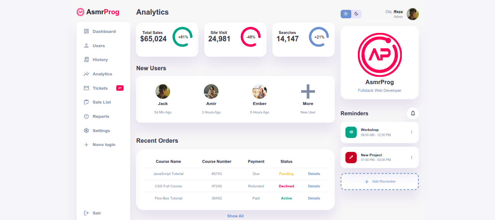

# 📊 Admin Dashboard

Projeto de painel administrativo desenvolvido com **React** e **Vite**, com foco em componentização, organização de layout, responsividade e modo escuro.

Esse projeto foi recriado com o objetivo de praticar conceitos importantes do front-end moderno, transformando um layout em uma aplicação mais organizada com React.

---


📸 Preview




## 🚀 Tecnologias utilizadas

- React
- Vite
- Styled Components
- React Router DOM
- JavaScript
- CSS

---

## ✨ Funcionalidades

- Layout de dashboard moderno
- Estrutura com componentes reutilizáveis
- Navegação entre páginas
- Dark mode
- Responsividade
- Organização visual de cards, pedidos recentes e informações do usuário

---

## 📁 Estrutura do projeto

```bash
src
├── assets
├── Components
├── pages
├── routes
├── styles
├── App.jsx
└── main.jsx
